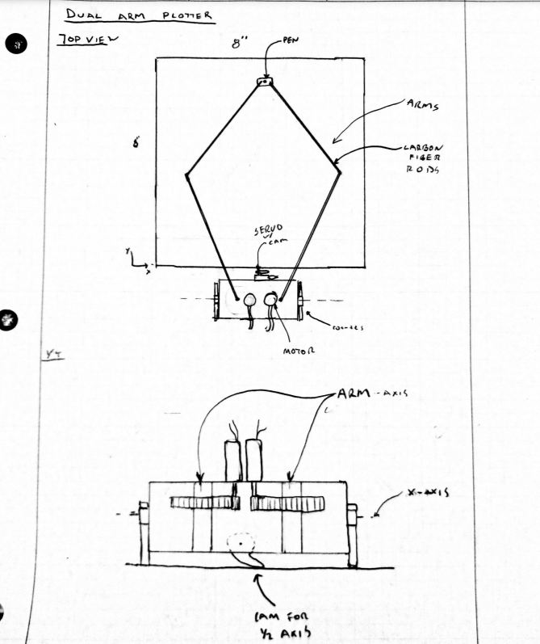

# ME405 Term Project

### Description
Our design uses a dual-arm plotter design. 
There will be two rotating arms connected to our positioning motors and two non-actuated joints that link to the carriage that holds the pen. 
By controlling the angles of the rotating arms, the plotter will control the pen position.
We will contain our positioning motors in a 3D-printed base and use a cam under the base to slightly lift and drop the pen.

G code will be used to communicate the pen position and movement to the plotter. We plan to use some light carbon fiber rods for our linkages. Our nucleo can provide the operating voltage for the servo,
so we will use either the bench power supply or a 12V battery to provide power to the motors.

### Bill Of Materials
| Qty. | Part                  | Source                | Est. Cost |
|:----:|:----------------------|:----------------------|:---------:|
|  2   | Pittman Gearmotors    | ME405 Tub             |     -     |
|  1   | Nucleo with Shoe      | ME405 Tub             |     -     |
|  1   | Lime Green Sharpie    | Staples               |   $1.02   |
|  1   | Hobby Servo           | Personal              |     -     |
|  2   | Carbon Fiber rods     | McMaster-Carr         |    $15    |
|  6   | Bearing               | Amazon                |    $20    |
|  2   | 1/4" Steel Shaft      | McMaster-Carr         |    $16    |
|  1   | H bridge Motor Driver | Personal              |     -     | 

### Sketch

### Referenced Diagram

