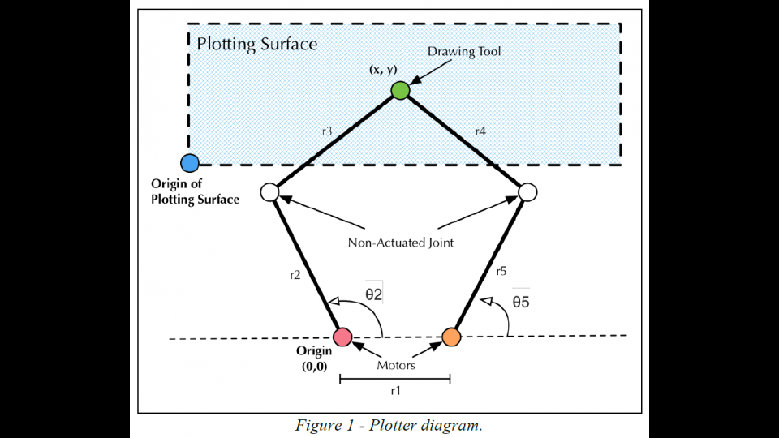

# ME405 Term Project

### Introduction
This goal of this project was to create a plotting robot capable of drawing images onto paper. The project allowed us to implement motion control, multitasking, and proper program orginization. The plotter must consist of 2.5 axis. The first two axis must cover at least a 4"x6" paper. The half axis acts as a boolean pen up or pen down. 

### Description
Our design uses a dual-arm plotter design. 
There will be two rotating arms connected to our positioning motors and two non-actuated joints that link to the carriage that holds the pen. 
By controlling the angles of the rotating arms, the plotter will control the pen position.
We will contain our positioning motors in a 3D-printed base and use a cam under the base to slightly lift and drop the pen.

G code will be used to communicate the pen position and movement to the plotter. We plan to use some light carbon fiber rods for our linkages. Our nucleo can provide the operating voltage for the servo,
so we will use either the bench power supply or a 12V battery to provide power to the motors.

### Bill Of Materials
| Qty. | Part                  | Source                | Est. Cost |
|:----:|:----------------------|:----------------------|:---------:|
|  2   | Pittman Gearmotors    | ME405 Tub             |     -     |
|  1   | Nucleo with Shoe      | ME405 Tub             |     -     |
|  1   | Lime Green Sharpie    | Staples               |   $1.02   |
|  1   | Hobby Servo           | Personal              |     -     |
|  2   | Carbon Fiber rods     | McMaster-Carr         |    $15    |
|  6   | 1/4" Bearing          | Amazon                |    $20    |
|  2   | 1/4" Steel Shaft      | McMaster-Carr         |    $16    |
|  1   | H bridge Motor Driver | Personal              |     -     | 

### Initial Sketch

### Referenced Diagram

We based our design off of this previously done project, source is below:
https://portfolium.com/entry/pen-gripping-dual-scara-arm-plotter

### Hardware 
After iterating on the plotter design, we came up with a final design shown below. 

The majority of our components were 3D printed. We 3D printed hubs with gear teeth to mesh with the puttman gear motors. That gear ratio was a 2/7 slowdown. This allowed us to have a higher resolution. The main housing was held together using threaded thermal inserts and M3 bolts. The use of carbon fiber decreased the inertia of our system and allowed us to move quickly. In the CAD, we included a tilt axis at the base of our main housing. We decided to scrap this and instead move the servo to the end of the linkage next to the pen. Also, we decided to offset the pen so that it didn't act through the bearings. Epoxy was added at the joints to strengthen. Changes showed below. 

### Video Links 
1 - https://youtu.be/_5m5r6dnIIY 
2 - https://youtu.be/3c9mipRUHZs 
3 - https://youtu.be/eMAQph7v7VM 

### Software Overview 

As mentioned in the mainpage, each hardware component on our machine has it's own driver. This was done so that the code could be portable and extremey modular which helped a lot with testing. Some problems with our software is that it has a lot of "magic numbers", and although we explain them in the code, they have no math to back them up. This is largely because we have no way to know exactly how long and at what period the cotasks for each function should be. Gain also varied between different pictures to get the best resolution.

### Results 

Testing: Tuning the controls was difficult as we did not have a starting point and did not want to break the 3D printed parts and have to reprint them. We first used the motors dettached from the machine to see if we could get the limit switches and angular design working. After confirming that it wouldn't break upon first use, we attached everything together while manually zeroing the encoders just to see if we could draw a line. We then slowly started adding in elements of the GCode parser until we got it drawing very very low resolution images. We then fine tuned the gains and refresh rates for a better resolution. After that was working we added the initialization sequence which gave us the most trouble out of all parts. After finicking with it we got it working and then added the servo to raise and lower the pen.

After tuning our control system we were able to produce three distinct shapes/images: hour glass, nested circles, and a balloon. 

### Takeaways 

One of the largest takeaways is how difficult it is to get a smooth image using our desing. We knew there would be jitter from the undampened arm desgin, but we thought that it would be negligible. Even with the lowered gearing, the resolution was still not as good as we expected it to be, even after hours of testing different feed rates and task refresh periods. In hindsight we shoul've foreseen this and either included a dampening system, included higher torque motors, or increased the gear ration so that the resolution was better.

